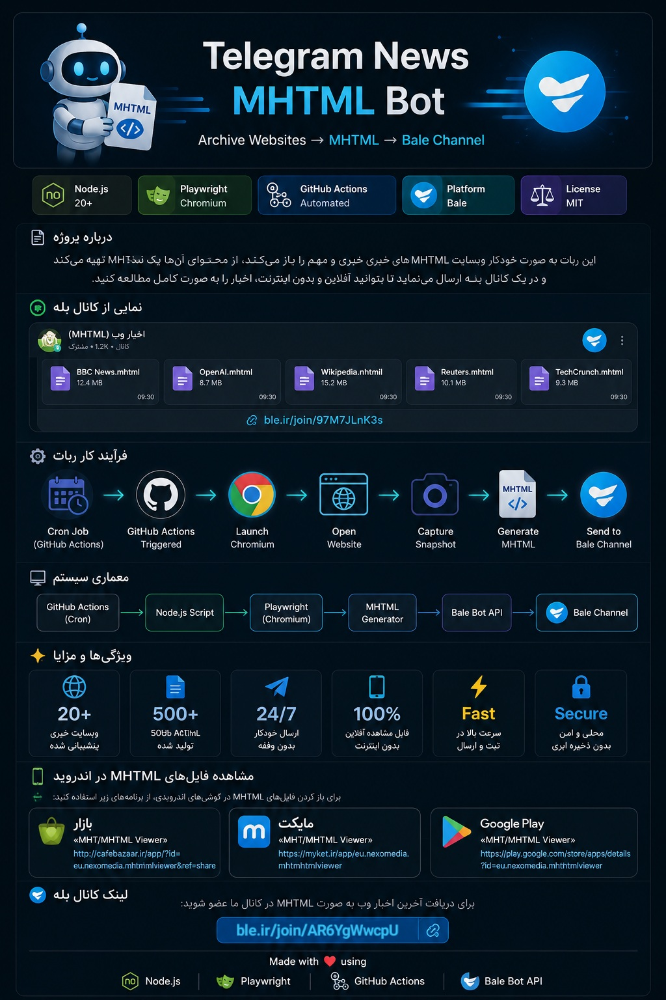
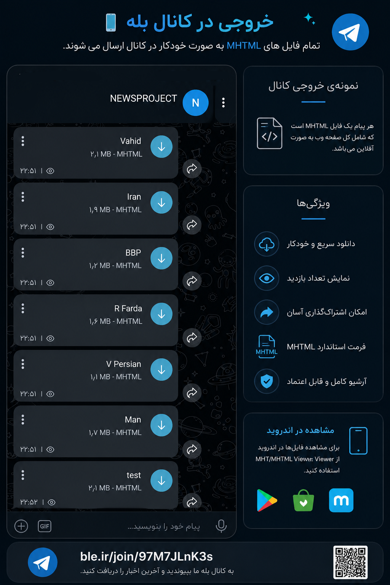

<p align="center">
  
</p>

<h1 align="center">🌐 Telegram News MHTML</h1>

<p align="center">
Automatically archive websites as <b>MHTML</b> and deliver them directly to a <b>Bale</b> channel using <b>GitHub Actions</b>.
</p>

<p align="center">
  
  
  
  
  
</p>

---

## 🚀 Overview

Telegram News MHTML is an automated web archiving project that periodically captures webpages using Chromium (Playwright), saves them as **MHTML** files, and automatically delivers them to a **Bale** channel.

The entire workflow runs on **GitHub Actions** and can be triggered by any external Cron Job service.

---

# ✨ Features

- 🌐 Archive any public website
- 📄 Generate standard MHTML files
- 🤖 Automatic delivery to Bale
- ⚡ Fully automated with GitHub Actions
- ⏰ External Cron Job compatible
- 📦 GitHub Artifact upload
- 🔄 Automatic retry on failures
- 📝 Detailed logging
- 📱 Offline viewing support
- 🚫 No local server required

---

# 🖼 Preview

<p align="center">
  
</p>

---

# ⚙️ Workflow

```text
External Cron Job
        │
        ▼
 GitHub Actions
        │
        ▼
 Launch Chromium
        │
        ▼
 Open Website
        │
        ▼
 Wait Until Loaded
        │
        ▼
 Capture Snapshot
        │
        ▼
 Generate MHTML
        │
        ▼
 Send to Bale
```

---

# 📂 Project Structure

```text
.
├── .github
│   └── workflows
│       └── news.yml
│
├── src
│   ├── browser.js
│   ├── bale.js
│   ├── config.js
│   ├── index.js
│   ├── logger.js
│   └── state.js
│
├── temp
├── state.json
├── package.json
└── README.md
```

---

# 📦 Output

Example generated archives:

```text
BBC News.mhtml
OpenAI.mhtml
Wikipedia.mhtml
Reuters.mhtml
TechCrunch.mhtml
```

Every file is a complete offline snapshot of the original webpage.

---

# 📢 Live Bale Channel

All generated archives are automatically published in the following Bale channel.

## 🔗 https://ble.ir/join/97M7JLnK3s

---

# 📱 Android Viewer

The generated files use the **MHTML** format.

To open them on Android, install **MHT/MHTML Viewer** from one of the following stores.

### Google Play

https://play.google.com/store/apps/details?id=eu.nexomedia.mhtmhtmlviewer

### Cafe Bazaar

http://cafebazaar.ir/app/?id=eu.nexomedia.mhtmhtmlviewer&ref=share

### Myket

https://myket.ir/app/eu.nexomedia.mhtmhtmlviewer

After downloading a file from the Bale channel, simply open it using the application above.

---

# 🛠 Built With

- Node.js
- Playwright
- Chromium
- GitHub Actions
- Bale Bot API

---

# 📊 Project Highlights

| Feature | Status |
|----------|--------|
| GitHub Actions | ✅ |
| Playwright | ✅ |
| Bale Integration | ✅ |
| MHTML Generation | ✅ |
| Offline Reading | ✅ |
| Multi Website Support | ✅ |

---

## 🌍 Part of the FREEDOM Project

This repository is a subproject of the larger **FREEDOM** ecosystem.

If you're interested in the complete project and its other components, feel free to visit the main repository:

👉 [FREEDOMPROJECT](https://github.com/amyrmhdyfrhzady/FREEDOMPROJECT)

⭐ If you like this project, consider checking out the main project as well.

---

# 📌 Project Status

This repository is published primarily for documentation and personal archival purposes.

The current workflow depends on private Bale Bot credentials and scheduled automation. Therefore, it is **not intended to be used as a plug-and-play package**.

---

# ❤️ Support

If you found this project interesting, please consider giving it a ⭐ on GitHub.

---

<p align="center">
Made with ❤️ using Node.js, Playwright, GitHub Actions and Bale Bot API.
</p>
